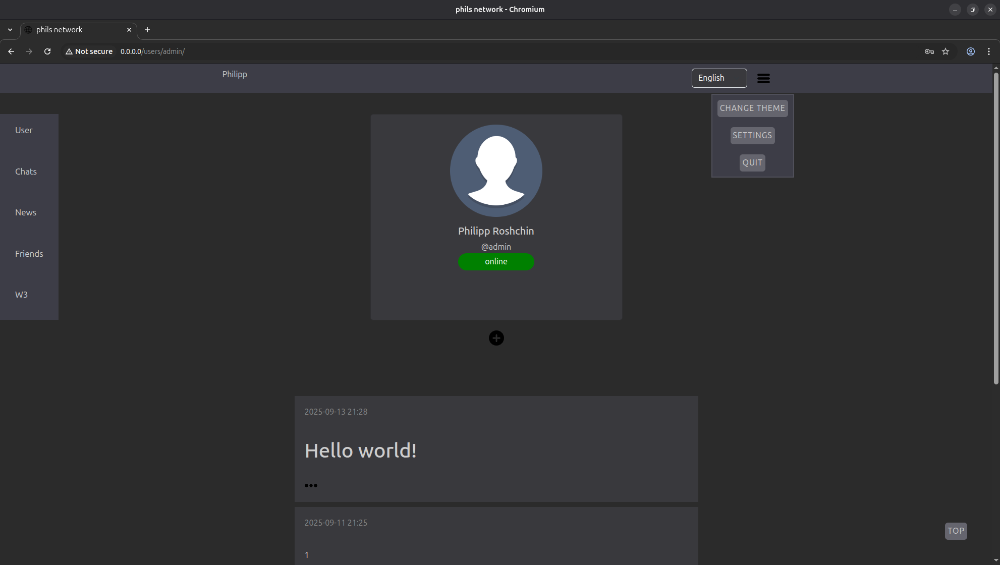
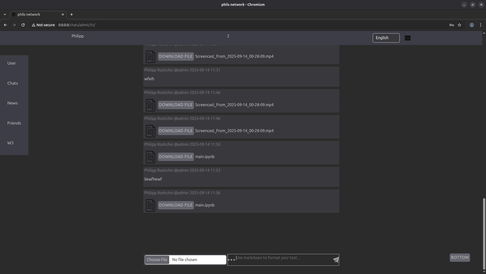

# Phils network v1.2.4

Minimalistic social network written using Django, FastAPI and React.

## What supports this app

* [x] Accounts and adding friends. Each user has the opportunity to maintain their own blog, subscribe to other people and see their blogs.

* [x] Dark theme.

* [x] You can create a conversation and chat with friends.

* [x] Lazy loading of pages, posts and messages.

* [x] Markdown posts and messages support.

* [x] You can send and download files.

* [x] You can see your Ethereum wallet (you need to pass `ethereum address` and `infura api key` in user settings).

* [x] You can send ETH to your friends.

* [x] Message image preview in the chat.

* [x] You can add a photo to your account.

* [x] You can reply to messages.

* [x] You can take part in video conferences. For each text conversation, a separate video conversation with the same name is created. If a secret key is added to a text conversation, this key must be written down for all participants in the conversation, after which the text and video conversation will be enabled.

* [x] I encrypted messages, and now they're stored in the database as a jumbled mess. And anyone with access to the database won't see anything. This key isn't shared anywhere, and it must be manually entered by the user to decrypt messages in a specific conversation. If a secret key is added to a specific conversation, that key is required for all users to record and then be able to share the video.

[User Agreement](UserAgreement.md) (by using the Service, the User confirms that he/she has read and accepts the terms of this Agreement)

\
Have fun and if you want please leave feedback!

## Technologies used

* Django \
<https://www.djangoproject.com/> 

* FastAPI \
<https://fastapi.tiangolo.com/>  

* Django REST framework \
<https://www.django-rest-framework.org/> 

* Postgres \
<https://www.postgresql.org/> 

* React \
<https://react.dev/learn> 

* Docker \
<https://www.docker.com/>  

* Minio \
<https://min.io/>  

## Production installation

```sh
docker-compose up

docker compose up --build

docker-compose run django python manage.py createsuperuser
```

Then go to <http://0.0.0.0/> \
Go to <http://0.0.0.0/admin_page/> to see django admin page \
Go to <http://0.0.0.0:8080/docs> to see Swagger documentation

If you are hosting this site, then go to `Front/react/src/data/constants.js` and replace `SERVER_HOST` with your server IP

## Tests

To run tests, use:

```bash
docker compose run -e TEST=1 --build fastapi pytest

# or

export TEST=1
cd Services/fastapi
pytest

# or

make test
```

## Development installation

### Using Makefile

```sh
make create_env
make test

make django
make fastapi
make react
```

Then go to <http://localhost:3000/>

### Other

Postgres.

```sh
brew install postgresql@15
brew link postgresql@15
brew services run postgresql@15

createuser -s postgres
createdb postgres --owner=postgres --username=postgres
psql postgres --username=postgres
```

Redis.

```sh
brew install redis
```

Run redis server in the new terminal window (to use the chat).

```sh
redis-server
```

Install micromamba

```sh
brew install micromamba
```

Run `setup.sh` script to create venv, DB migrations, superuser and collect static files.

```sh
bash setup.sh
```

Activate micromamba enviroment.

```sh
micromamba activate phils_network
```

**Phils_network** supports `gunicorn` (with `uvicorn` async workers).

```sh
export DEVELOPMENT=1

cd Services/django

python manage.py migrate

bash gunicorn.sh
```

FastAPI:

```bash
export DEVELOPMENT=1

cd Services/fastapi

uvicorn app.main:app --host 0.0.0.0 --port 8000 --workers 1
```

\
See `phils_network/Services/django/gunicorn.conf.py` for more information about gunicorn configuration.

Then go to the frontend directory `phils_network/Front/react/`. Install npm packages.

```sh
npm install
```

\
By default, django server runs on the 0.0.0.0 host and 8080 port (see `phils_network/Services/django/gunicorn.sh` file). So make sure that SERVER_HOST and SERVER_PORT variables in the `phils_network/Front/react/app/data/constants.js` file are similar to your backend.

Create production frontend app.

```sh
VITE_DEVELOPMENT=1 npm run dev
```

Home page:


<br />

Chat page:


<br />

Video:

<video src="pictures/video.mp4" controls></video>
