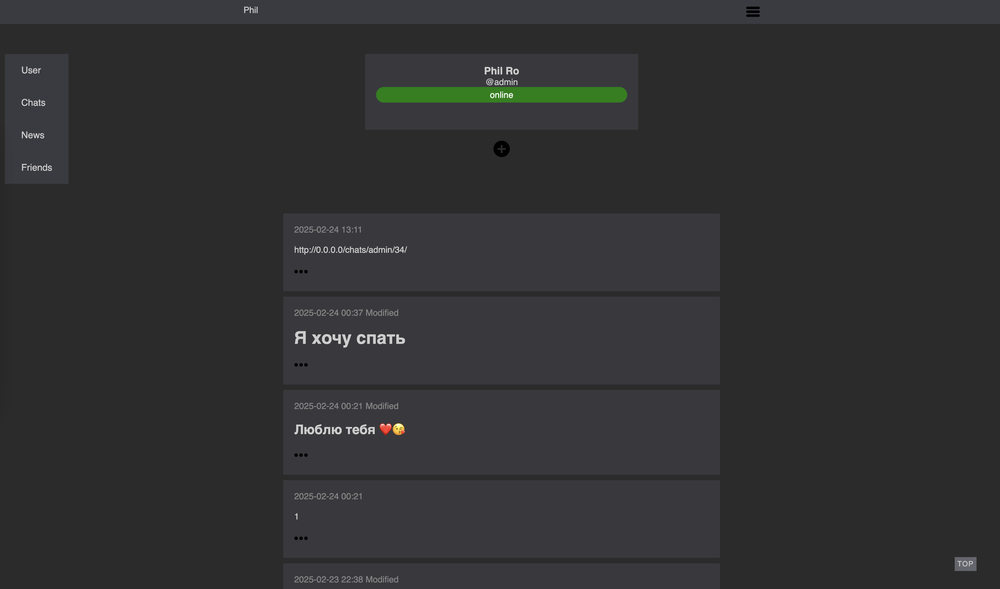

# phils_network

Minimalistic social network written using Django and React.

> You may donate to [phils_network](https://github.com/PHILIPP111007/phils_network) project:
>
> * Ethereum: 0xE2e2D675a3843f4ED211BB93847ad18b0A6fe7c6

Welcome to version 3.0.0!

## What supports this app

* [x] Accounts and adding friends. Each user has the opportunity to maintain their own blog, subscribe to other people and see their blogs.

* [x] Dark theme.

* [x] You can create a conversation and chat with friends.

* [x] Lazy loading of pages, posts and messages.

* [x] Browser caching lists of user rooms and first N messages in each room.

* [x] Markdown posts support

\
Have fun and if you want please leave feedback!

## Technologies used

* Django \
<https://www.djangoproject.com/> 

* Django REST framework \
<https://www.django-rest-framework.org/> 

* django-channels \
<https://channels.readthedocs.io/en/stable/index.html>

* gunicorn \
<https://docs.gunicorn.org/en/stable/index.html>

* Redis \
<https://redis.io/docs/> 

* Postgres \
<https://www.postgresql.org/> 

* React \
<https://react.dev/learn> 

* Docker \
<https://www.docker.com/>  

## Production installation

```sh
docker-compose up -d

docker-compose run django python manage.py createsuperuser
```

Then go to <http://0.0.0.0/> \
Go to <http://0.0.0.0/admin/> to see django admin page

## Development installation

Postgres.

```sh
brew install postgresql@15
brew link postgresql@15
brew services run postgresql@15

createuser -s postgres
createdb postgres --owner=postgres --username=postgres
psql postgres --username=postgres
```

Redis.

```sh
brew install redis
```

Run redis server in the new terminal window (to use the chat).

```sh
redis-server
```

Install micromamba

```sh
brew install micromamba
```

Run `setup.sh` script to create venv, DB migrations, superuser and collect static files.

```sh
bash setup.sh
```

Activate micromamba enviroment.

```sh
micromamba activate phils_network
```

**Phils_network** supports `gunicorn` (with `uvicorn` async workers).

```sh
bash gunicorn.sh
```

\
See `phils_network/Services/django/gunicorn.conf.py` for more information about gunicorn configuration.

Then go to the frontend directory `phils_network/Front/react/`. Install npm packages.

```sh
npm install
```

\
By default, django server runs on the 0.0.0.0 host and 8000 port (see `phils_network/Services/django/gunicorn.sh` file). So make sure that SERVER_HOST and SERVER_PORT variables in the `phils_network/Front/react/src/data/constants.js` file are similar to your backend.

Create production frontend app.

```sh
npm run build
```

Run the frontend app.

```sh
npm install -g serve
serve -s build
```


